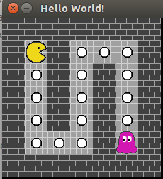

# Spiele mit C++ programmieren

**Ein Kurs in objektorientierter Programmierung**

**(c) 2016 Dr. Kristian Rother**

## Ziel dieses Kurses

Objektorientierte Programmierung mit C++ lernen, indem ein Computerspiel programmiert wird.

## Voraussetzungen

* Grundkenntnisse in C oder einer verwandten Programmiersprache.
* Ein C++ - Compiler
* Ein PC mit Windows, Linux oder MacOS

----

## Das Spiel "Maze"

Die Spielfigur sammelt Punkte gegen die Zeit. Am Spielfeldrand befinden sich Mau
ern. Der Spieler wird nach einer gewissen Zeit von Geistern verfolgt welche ihn 
töten können. Über Mauern darf nicht gelaufen werden. Der Highscore der Spieler 
kann gespeichert werden. Alternativ kann man auch gegen einen zweiten Spieler sp
ielen. Der Rattenschwanz läßt sich an und ausschalten. Es soll eine Level-Auswah
l geben. Die Spielfigur soll ihr Aussehen je nach Richtung ändern können. Das Sp
iel soll Sound unterstützen. Ziel ist es, in einer gewissen Zeit eine Anzahl Pun
kte zu essen. Neben Mauern gibt es auch andere Hindernisse.

----

## Links

### C++ Tutor

Nachschlagwerk in deutscher Sprache:

[www.cpp-tutor.de](http://www.cpp-tutor.de)

### C++ Programmierung

Einführungsbuch von Benjamin Buch (unter CC-Lizenz):

[de.wikibooks.org/wiki/C%2B%2B-Programmierung/_Inhaltsverzeichnis](https://de.wikibooks.org/wiki/C%2B%2B-Programmierung/_Inhaltsverzeichnis)

### C-Howto

Übersicht über C-Grundlagen

[c-howto.de](http://c-howto.de)

### Weitere Links

* [www.online-tutorials.net/c-c++-c/c%2B%2B-tutorial-kleine-einfhrung-in-die-oop/tutorials-t-1-230.html](http://www.online-tutorials.net/c-c++-c/c%2B%2B-tutorial-kleine-einfhrung-in-die-oop/tutorials-t-1-230.html)
* [www.yolinux.com/TUTORIALS/LinuxTutorialC++.html](http://www.yolinux.com/TUTORIALS/LinuxTutorialC++.html)
* [www.cprogramming.com/tutorial/c++-tutorial.html](http://www.cprogramming.com/tutorial/c++-tutorial.html)
* [www.howtoforge.com/learning-c-cplusplus-step-by-step](https://www.howtoforge.com/learning-c-cplusplus-step-by-step)

----

## Lizenz

Sämtliche Materialien in diesem Kurs sind unter den Bedingungen der MIT License verfügbar.

