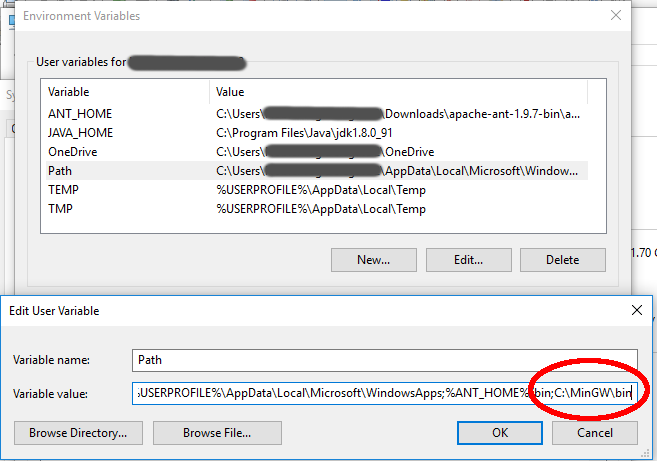

# Compilieren auf der Kommandozeile

Wir können ein C++-Programm auch ohne Code::Blocks compilieren. Wir rufen dazu den Compiler direkt von der **Kommandozeile** aus.

## Ist der C++-Compiler ausführbar?

Öffne eine Windows-Konsole (führe das Programm `cmd` aus). Tippe ohne das Verzeichnis zu wechseln `g++` ein. Wenn die Fehlermeldung (*`fatal error`*) erscheint, hat alles funktioniert.

## Wenn es nicht funktioniert: Pfad auf MinGW setzen

Damit Du den Compiler `g++` auf  überall her starten können, musst Du *einmalig*  eine sogenannte **Pfadvariable** setzen. Windows sucht nach zu startenden Programmen in den im Pfad angegebenen Verzeichnissen. Und so geht es (*unter Windows 10 ist es vermutlich schon wieder anders :-(*):

1. Öffne die *Systemsteuerung*
2. Öffne dort die Kategorie *System*
3. Wähle dort den Abschnitt *Erweiterte Systemeinstellungen* oder *Erweitert*
4. Drücke den Knopf *Umgebungsvariablen*
5. Erstelle eine neue Umgebungsvariable *PATH* mit dem Wert *`C:\MinGW\bin`* . Falls *PATH* bereits definiert ist, kannst Du über **ein Semikolon** weitere Verzeichnisse anhängen, also `was_schon_da_war;C:\MinGW/bin`
6. Schliesse den Dialog und die Systemsteuerung wieder. **Erst dann werden die Änderungen wirksam**.

## Compilieren unter Windows

1. Erstelle mit einem Texteditor ein kleines C++-Programm, z.B. `hello.cpp`.

2. Klicke im Dateimanager in die Adreßzeile. Merke oder kopiere Dir den dort sichtbaren **Pfad**.

2. Öffne eine Windows-Kommandozeile.

3. Wechsle in das Verzeichnis mit Deinem Programm.

4. Rufe den Compiler auf:

    g++ hallo.cpp -o hallo.exe

Die Option `-o` sagt dem Compiler, dass die Ausgabe in die Datei `hallo.exe` geschrieben werden soll.

5. Rufe das compilierte Programm auf, indem Du in der Konsole `hallo.exe` eingibst.

## Compilieren unter Linux und Mac

Grundsätzlich funktioniert das Kompilieren genauso, außer daß:

1. Suche nach **Terminal** um eine Kommandozeile zu öffnen
2. Es gibt beim `cd`-Befehl keine Verzeichnisse mit `C:` usw.
3. Der Befehl `dir` heißt `ls`
4. Um ein compiliertes Programm auszuführen mußt Du eingeben z.B.:

    ./hello.exe

Oder wenn Du keinen Namen der Ausgabedatei angibst:

    ./a.out
