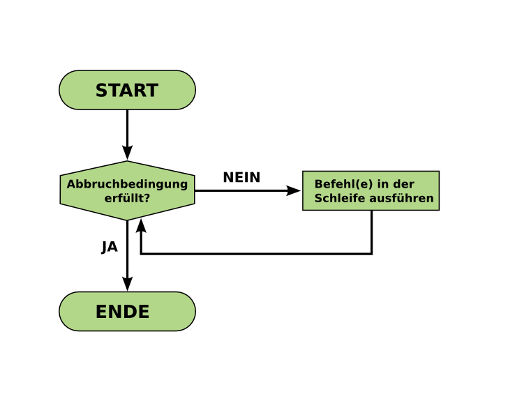
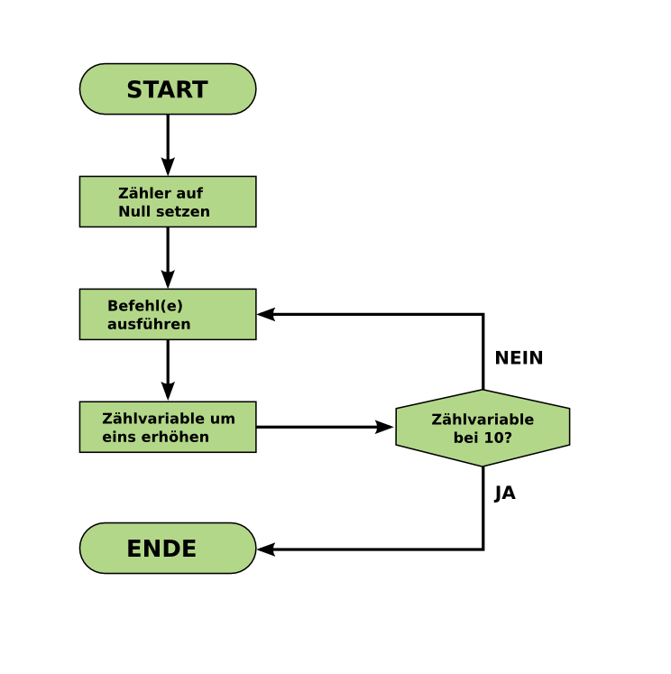

# Schleifen

Schleifen wiederholen Anweisungen. Es gibt drei Arten von Schleifen in C++.

## Bedingte Schleifen mit `do..while`

Die `do..while` Schleife wiederholt Anweisungen, solange die Bedingung am Ende wahr ist. Die Schleife wird mindestens ein Mal ausgeführt.

    int a = 10;
    do {
        cout << "Countdown ist bei: " << a << endl;
        a = a - 1;
    } while (a > 0);

Es ist wichtig, daß die Variable in der Bedingung (`a`) *außerhalb* der Schleife definiert wird.

## Bedingte Schleifen mit `while`

Es geht auch umgekehrt. Bei einer `while`-Schleife steht die Bedingung am Anfang. Daher kann es sein, daß eine `while`-Schleife kein Mal ausgeführt wird.

Ein Beispiel:

    int a = 10;
    while (a > 0) {
        cout << "Countdown ist bei: " << a << endl;
        a = a - 1;
    }

### Achtung, Endlosschleifen!

Mit `do..while` und `while` ist es möglich, Endlosschleifen zu bauen. Ein häufiger Fehler ist, die Variable für die Abbruchbedingung zu vergessen. Folgendes Programm läuft ewig weiter:

    int a = 10;
    while (a > 0) {
        cout << "Countdown ist bei: " << a << endl;
    }

## `for`-Schleifen

Schleifen mit `for` haben statt einer Bedingung eine *Zählervariable*. Mit `for`-Schleifen kannst Du Anweisungen eine bestimmte Anzahl von Malen wiederholen.

Auch hierzu ein Beispiel:

    for (int i=0; i < 10; i++) {
        cout << "Zahl: " << i << endl;
    }

Der Ausdruck in der runden Klammer beim `for` bedeutet folgendes:

1. Zu Beginn der Schleife setze die Zählervariable `i` auf 0.
2. Die Schleife soll so lange laufen, wie `i` kleiner als 10 ist.
3. Nach jedem Schleifendurchlauf, erhöhe `i` um 1. (Der Operator `++` tut das gleiche wie `i=i+1`)
